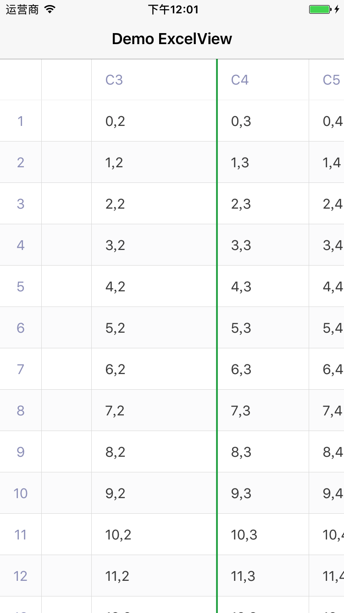
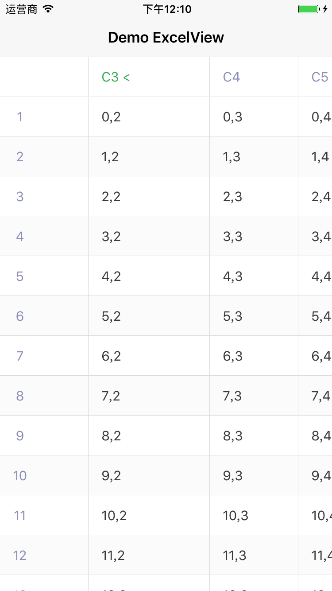
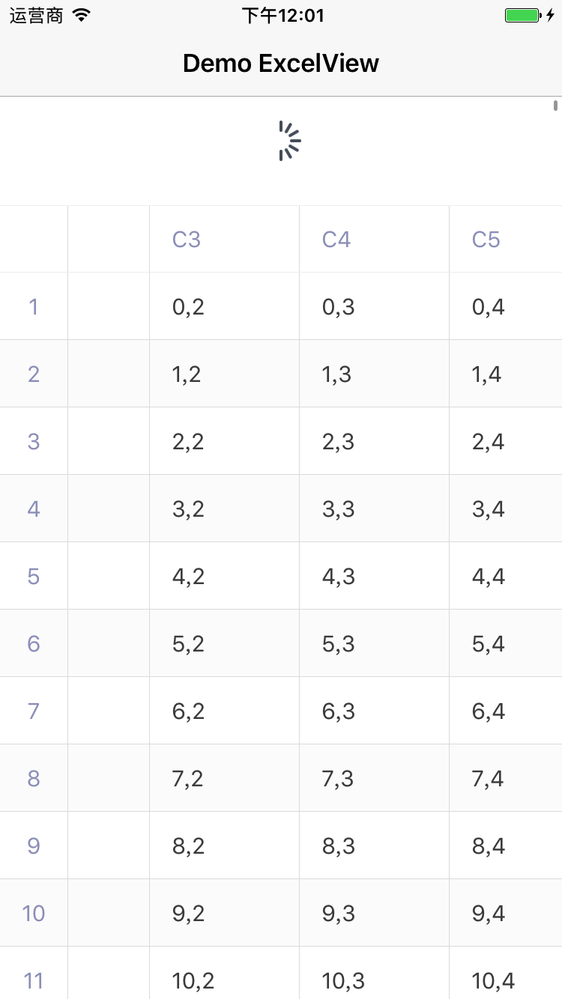
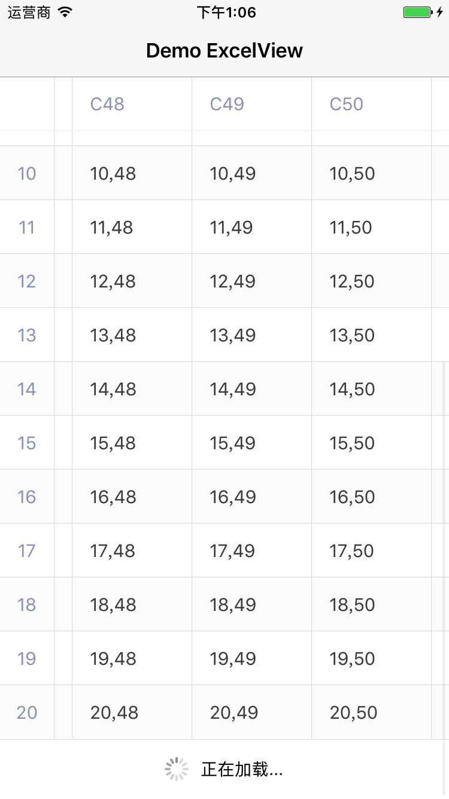

# HBExcelView

实现类似Excel表格样式的数据显示

### 特性

- 支持左右滚动
- 支持调整列宽度

- 支持定制左侧固定显示列
- 支持列头三段式排序交互

 
- 支持cell重用：大量行列数据情况下，性能表现良好
- 支持下拉刷新交互

- 支持滚动到底部加载更多交互

- 通过定制HBExcelColumnCell，实现不同样式cell数据显示

### Features

1. support reusable column cells 
2. support fixed columns config
3. change column width by drag
4. demo refreshing data by pull down
5. demo auto loading more by scrolling to the bottom
6. column header click event with status custom ...

### Usage

clone and run it.

### TODO

a lot ...